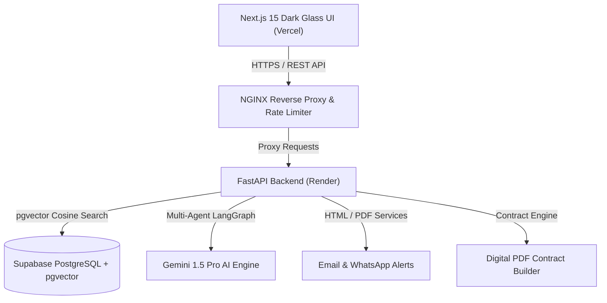
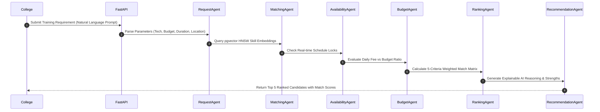
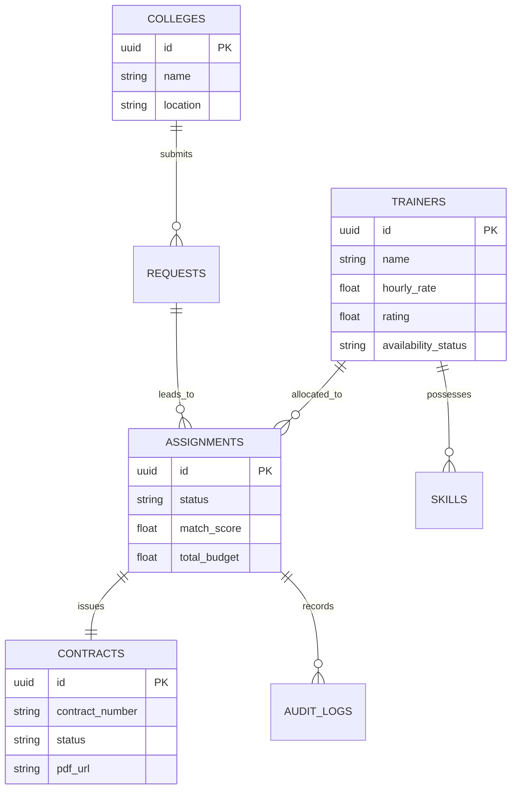
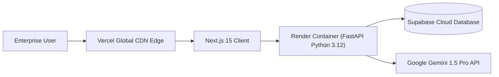

# ALLOCATOR.AI System Architecture Diagrams

### 1. Overall System Architecture

### 2. Multi-Agent AI Workflow Sequence

### 3. Database Entity Relationships (ER Diagram)

### 4. Cloud Infrastructure Topology

