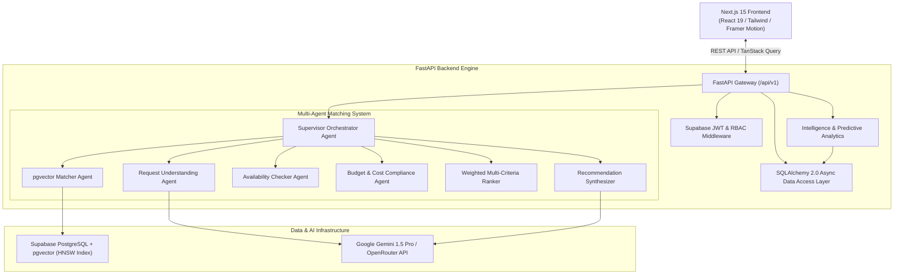
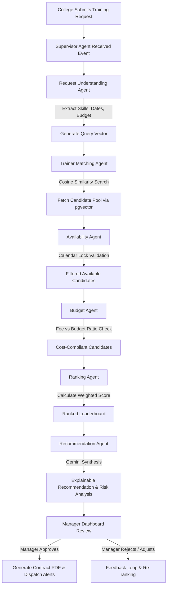

# ALLOCATOR.AI - Enterprise Agentic AI Trainer Allocation Platform

[](https://nextjs.org/)
[](https://fastapi.tiangolo.com/)
[](https://python.org)
[](https://supabase.com/)
[](https://ai.google.dev/)
[](https://www.docker.com/)
[](https://opensource.org/licenses/MIT)

**ALLOCATOR.AI** is an enterprise-grade autonomous SaaS web platform that automates technical trainer matching and resource allocation between universities, bootcamps, and industry experts. Built with **Next.js 15 App Router**, **FastAPI**, **LangGraph**, and **Supabase pgvector**, the platform replaces 3–5 days of manual search and negotiation with autonomous AI matching in under 4 seconds.

---

## 🏗️ System Architecture



---

## 🔄 Agentic AI Multi-Agent Matching Flowchart



---

## 🌟 Key Features & Module Overview

### 1. Enterprise Landing Page & Perspective Switcher
- Dark mode aesthetic (`#09090B`) with glassmorphism, Aurora background effects, and glowing gradients.
- Interactive perspective switching between **Manager**, **College Dean**, **Trainer**, and **Admin** modes.
- Instant floating **Reset Demo** button to refresh initial dataset state for live client demonstrations.

### 2. Autonomous Multi-Agent Allocation Engine
- **7 Specialized Agents**:
  - `RequestUnderstandingAgent`: Parses natural language requirements into structured JSON specs.
  - `TrainerMatchingAgent`: Executes semantic vector search via HNSW `pgvector` indexes.
  - `AvailabilityAgent`: Validates schedule conflicts against active calendar slots.
  - `BudgetAgent`: Ensures rate compliance and computes cost efficiency scores.
  - `RankingAgent`: Computes a 5-factor weighted matrix (35% Skill, 25% Availability, 20% Budget, 10% Rating, 10% Exp).
  - `RecommendationAgent`: Generates AI explainability write-ups, strengths, risks, and confidence scores.
  - `SupervisorAgent`: Orchestrates the state graph workflow with fallback strategies.

### 3. Complete Assignment Lifecycle Workflow
- Interactive **Manager Approval Modal** with real-time risk assessment and candidate comparison.
- Digital **PDF Contract Engine** (`CTR-2026-xxx`) with automated checksum verification.
- **7-Step Assignment Timeline** tracking status from request submission to calendar locking.
- Simulated Email & WhatsApp notification alerts for trainers and college deans.

### 4. Executive Intelligence & Datadog-style Telemetry
- Recharts visualizations: Trainer Utilization Radar, Monthly Demand Bar Charts, Budget Breakdown Donut Charts.
- Gemini-powered **Predictive Demand Forecasting** for emerging technology domains (GenAI, Cloud Native, Cybersecurity).
- Live Telemetry dashboard showing API Gateway Latency, HNSW Index Vector Speed, Token Usage, and Health Diagnostics.
- On-demand **PDF & CSV Executive Report Generator**.

---

## 💻 Tech Stack

| Layer | Technology |
|---|---|
| **Frontend Framework** | Next.js 15 (App Router), React 19, TypeScript |
| **Styling & UI** | Tailwind CSS, Glassmorphism design, Framer Motion animations |
| **State & Data Fetching** | TanStack Query (React Query v5), React Hook Form, Zod |
| **Data Visualizations** | Recharts, Lucide Icons |
| **Backend Framework** | FastAPI (Python 3.12), Uvicorn |
| **ORM & Database** | SQLAlchemy 2.0 Async, Supabase PostgreSQL, `pgvector` extension |
| **AI Orchestration** | LangGraph, LangChain, Google Gemini 1.5 Pro API |
| **DevOps & Containers** | Docker, Docker Compose, NGINX Reverse Proxy, GitHub Actions CI/CD |

---

## 🚀 Local Development Setup

### Prerequisites
- **Node.js**: v20+
- **Python**: v3.12+
- **Git**

### 1. Clone Repository
```bash
git clone https://github.com/rishabhverma007/Agentic-AI-Trainer-Platform.git
cd Agentic-AI-Trainer-Platform
```

### 2. Setup & Run Backend (FastAPI)
```bash
cd backend
python -m venv venv

# Windows PowerShell:
.\venv\Scripts\activate

# macOS / Linux:
# source venv/bin/activate

pip install -r requirements.txt
python -m app.seed.seed_data
uvicorn main:app --reload --port 8000
```
- **Backend API**: [http://localhost:8000](http://localhost:8000)
- **Swagger Documentation**: [http://localhost:8000/docs](http://localhost:8000/docs)

### 3. Setup & Run Frontend (Next.js 15)
In the root directory:
```bash
npm install
npm run dev
```
- **Web App**: [http://localhost:3000](http://localhost:3000)

---

## 🐳 Docker Deployment

To run the complete platform in isolated production containers using Docker Compose:

```bash
docker-compose up --build -d
```

Services exposed:
- **Frontend App**: `http://localhost:3000`
- **FastAPI Backend**: `http://localhost:8000`
- **NGINX Reverse Proxy**: `http://localhost:80`

---

## 🧪 Automated Testing

### Backend Unit & Integration Tests (Pytest)
```bash
cd backend
.\venv\Scripts\pytest
```
Runs tests covering:
- `/api/v1/health` diagnostic checks
- Multi-agent matching engine pipeline
- Executive intelligence API
- Workflow approval endpoints

### Frontend Typecheck & Build
```bash
npm run build
```

---

## 📄 License

Distributed under the **MIT License**. See `LICENSE` for details.

Developed with ❤️ by **Rishabh Verma** using Google DeepMind Agentic AI principles.
