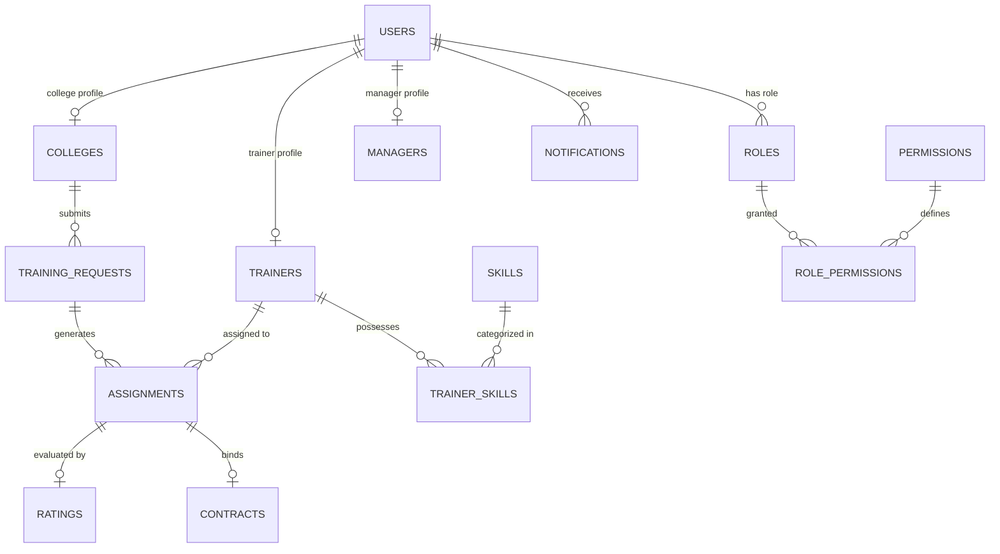

# PostgreSQL Database ER Diagram - ALLOCATOR.AI

## Schema Entities Summary
1. **users**: Primary user auth credentials, role designation, soft-delete.
2. **roles & permissions**: RBAC security matrix (ADMIN, MANAGER, COLLEGE, TRAINER).
3. **colleges**: Institution profile details, locations, contact person.
4. **trainers**: Hourly rate, rating, total trainings, verified certifications, availability.
5. **skills & trainer_skills**: Technical skill taxonomy (GenAI, PyTorch, RAG, Next.js 15, MLOps, AWS, Cybersecurity).
6. **training_requests**: College requirements (budget, dates, student count, mode, technology).
7. **assignments**: Approved allocations linking college request and trainer with match score & contract status.
8. **ratings**: 5-star feedback and text reviews.
9. **contracts**: Binding agreement URLs and signature status.
10. **notifications**: Real-time activity notifications.
